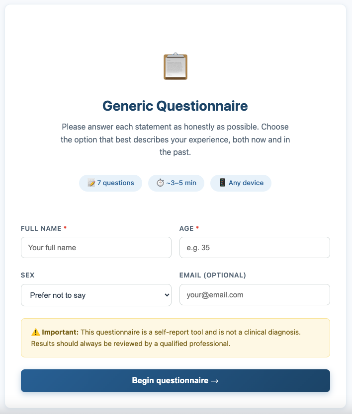

# Single-File Questionnaire Template

A zero-dependency, single-HTML-file framework for delivering self-report questionnaires in clinical or research settings. Drop it on any static host and it works - no server, no build step, no package manager.

Built for psychologists, researchers, and developers who need to deploy a validated instrument quickly without a backend.

## Preview



## Features

- **One file, no dependencies** — a single `.html` file you can host anywhere (GitHub Pages, GoDaddy, Netlify, Vercel, or a local file system)
- **One question per page** - clean, focused UX with a progress bar and back/next navigation
- **Auto-save** — progress is saved to `localStorage` so participants can recover from accidental tab closes
- **Direct and reverse scoring** — declare reverse-scored item IDs in a single array; the formula is applied automatically
- **Subscale support** — group items into named subscales; scores are computed and displayed automatically
- **Interpretation bands** — map score ranges to colour-coded labels and descriptive text
- **Email delivery** — optional EmailJS integration sends a full score report to the clinician after each completion; no server required
- **Participant information form** — collects name, age, sex, and email before the questionnaire begins (all fields configurable)
- **Intermediate screen** — gives participants a choice between submitting results or viewing them locally, before scores are shown
- **Clinician-only mode** — scores can be hidden from participants entirely while still being emailed to the clinician
- **Responsive** — works on desktop, tablet, and mobile

---

## Who is this for?

- **Clinicians** who want to administer a standardised instrument online and receive results by email
- **Researchers** who need a lightweight, customisable data-collection interface without a backend
- **Developers** building on top of a validated questionnaire framework

---

## Quick start

1. Download `instrument-template.html`
2. Open it in any text editor
3. Find the `<script>` block near the bottom of the file
4. Edit the three configuration objects:

```js
// 1. Instrument name, description, and estimated time
const QUIZ_CONFIG = { ... };

// 2. Your items — replace with your own
const QUESTIONS = [
  { id: 1, text: 'Statement one.' },
  { id: 2, text: 'Statement two.' },
  // ...
];

// 3. Scoring rules — response scale, reverse items, bands, subscales
const SCORE_RULES = { ... };
```

5. Add your EmailJS credentials (or leave the placeholders to disable email)
6. Upload the single file to any static host

---

## Configuration reference

All customisation happens inside three JavaScript objects. Nothing else needs to change.

### `QUIZ_CONFIG`

| Property | Description |
|---|---|
| `shortTitle` | Instrument name shown in the sticky header during the questionnaire |
| `fullTitle` | Full name shown on the welcome screen and browser tab |
| `description` | Subtitle shown below the title on the welcome screen |
| `estimatedTime` | Shown as an info chip, e.g. `~5–10 min` |
| `icon` | Emoji shown in the welcome hero (decorative) |

### `QUESTIONS`

An array of objects, each with:

| Property | Type | Description |
|---|---|---|
| `id` | `number` | Unique integer identifier. Do not change after data collection begins. |
| `text` | `string` | The statement shown to the participant |

Mark reverse-scored items with a comment for clarity — the actual reverse logic is configured in `SCORE_RULES`.

### `SCORE_RULES`

| Property | Type | Description |
|---|---|---|
| `answerOptions` | `Array<{label, value}>` | Response options shown for every question |
| `maxItemValue` | `number` | Highest value in `answerOptions`; used for reverse scoring |
| `reverseScoredItems` | `number[]` | Item IDs to reverse-score. Set to `[]` to disable. |
| `maxTotalScore` | `number \| null` | `null` = auto (`QUESTIONS.length × maxItemValue`) |
| `bands` | `Array<{min, max, label, text, color}>` | Score ranges mapped to interpretive labels |
| `subscales` | `Array<{name, itemIds, maxScore}>` | Subscale groupings. Set to `[]` to hide. |

### `EMAILJS_CONFIG`

| Property | Description |
|---|---|
| `publicKey` | Your EmailJS public key |
| `serviceId` | Your EmailJS service ID |
| `templateId` | Your EmailJS template ID |
| `recipientEmail` | The clinician/researcher email that receives each report |

Leave `publicKey` as `'YOUR_PUBLIC_KEY'` to disable email delivery entirely.

---

## Scoring

All answers are stored as raw values. Scored values are computed on demand when results are shown.

**Direct items:** `scoredValue = rawValue`

**Reverse items:** `scoredValue = maxItemValue − rawValue`

Example with a 4-point scale (`maxItemValue = 3`):

| Response | Raw value | Direct scored | Reverse scored |
|---|---|---|---|
| Never true | 0 | 0 | 3 |
| Rarely true | 1 | 1 | 2 |
| Often true | 2 | 2 | 1 |
| Always true | 3 | 3 | 0 |

Subscale scores and the total score are both computed this way. Storing raw values means you can correct a reverse-coding mistake later without re-collecting data.

---

## Optional features

Every major feature can be enabled or disabled without touching the core logic.

### Participant information form
The welcome screen collects name (required), age (required), sex, and email. Remove or add fields by editing the `.form-group` blocks in Screen 1 and the matching reads in `startQuestionnaire()`. For anonymous administration, remove all fields.

### Email delivery
Email delivery via [EmailJS](https://www.emailjs.com/) is optional. Add your credentials to `EMAILJS_CONFIG` to enable it. To disable, leave the placeholder values — the app skips delivery silently. To replace EmailJS with your own endpoint, swap the `emailjs.send()` call in `sendEmail()` for a `fetch()` POST.

Available template variables for your EmailJS template:

```
{{patient_name}}     {{patient_email}}    {{patient_age}}       {{patient_sex}}
{{date}}             {{total_score}}      {{score_numeric}}     {{interpretation}}
{{score_band_text}}  {{subscale_summary}} {{to_email}}
```

### Subscale scores
Populate `SCORE_RULES.subscales[]` with your subscale definitions. Set to `[]` to hide the subscale section entirely — no HTML changes needed.

### Interpretation bands
Define score ranges in `SCORE_RULES.bands[]` using your instrument's validated cut-scores. Remove the `.interpretation-card` block from Screen 4 if no validated thresholds exist for your instrument.

### Reverse scoring
List reverse-scored item IDs in `SCORE_RULES.reverseScoredItems`. Set to `[]` if all items are scored in the same direction.

---

## Hiding scores from participants

> ⚠️ Many validated screening instruments — including PHQ-9, GAD-7, PCL-5, AUDIT, and various autism and ADHD screeners — are designed to be **interpreted by a clinician**, not shown directly to participants. Displaying a raw score or a band label without clinical context can cause unnecessary distress or be misunderstood.

To hide scores from participants while still delivering a full report to the clinician:

1. Remove or replace Screen 4 (the results screen) with a simple "Thank you — your responses have been submitted" card
2. In Screen 3, replace both buttons with a single "Submit" button that calls a `submitOnly()` function
3. `submitOnly()` should call `clearState()` and `sendEmail()`, then show the thank-you screen

The scoring logic and email delivery are unaffected — the clinician receives the full report.

---

## Common customisations

| Goal | What to change |
|---|---|
| Change the response scale | `SCORE_RULES.answerOptions[]` and `maxItemValue` |
| Use a 5-point Likert scale | Add a 5th option with `value: 4`; set `maxItemValue: 4` |
| Remove subscales | `SCORE_RULES.subscales: []` |
| Disable reverse scoring | `SCORE_RULES.reverseScoredItems: []` |
| Hide scores from participants | Replace Screen 4 with a thank-you card (see above) |
| Disable email | Leave `EMAILJS_CONFIG.publicKey` as `'YOUR_PUBLIC_KEY'` |
| Replace EmailJS with a database | Swap `emailjs.send()` in `sendEmail()` for a `fetch()` POST |
| Change the colour scheme | Edit the CSS custom properties in `:root {}` |
| Localise the interface | Replace English strings in the HTML and in `QUIZ_CONFIG` |
| Multiple instruments on one domain | Change `STATE_KEY` per instrument to avoid localStorage collisions |

---

## File structure

The file is a single `.html` document. The JavaScript section is divided into clearly labelled sections:

```
SECTION 1  QUIZ_CONFIG        instrument metadata
SECTION 2  QUESTIONS          the items array
SECTION 3  SCORE_RULES        scoring configuration
SECTION 4  EMAILJS_CONFIG     email delivery credentials
SECTION 5  APP STATE          runtime state (do not edit)
SECTION 6  INITIALISATION     runs once on page load
SECTION 7  NAVIGATION         screen transitions and question rendering
SECTION 8  SCORING            score computation functions
SECTION 9  RESULTS            results screen population
SECTION 10 EMAIL DELIVERY     EmailJS integration
SECTION 11 UTILITIES          helper functions
```

For a new instrument, edit only Sections 1–4.

---

## Deployment

Upload the single `.html` file to any static host. No server-side code is required.

Tested on: GitHub Pages · GoDaddy · Netlify · Vercel · local `file://`

---

## License

MIT — free to use, modify, and distribute for any purpose, including clinical and commercial use. Attribution appreciated but not required.
